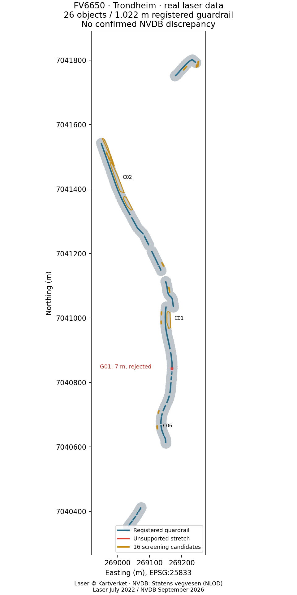
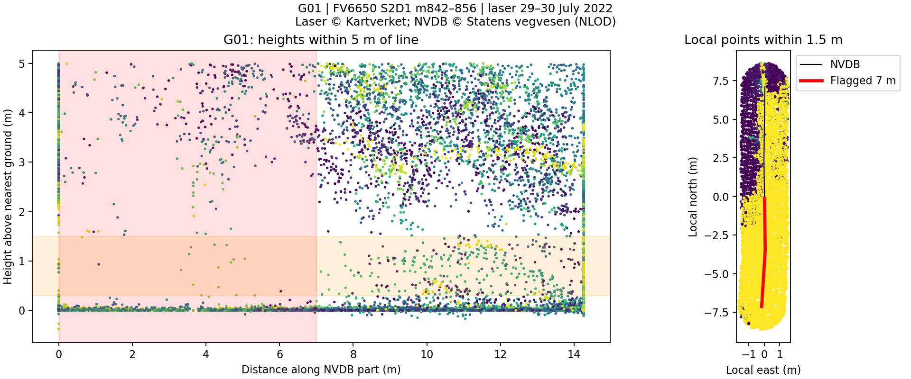

# Guardrails: NVDB vs laser data

A small Python project comparing registered guardrail lines with laser points at guardrail height. Results are candidates for review, not proof of errors in NVDB.

## Status and results

**Real-data study completed on FV6650 in Trondheim:** 26 guardrail objects, 1,022 m of registered geometry and 3.76 million analysed laser points from NDH Trondheim 30pkt 2022. The analysis produced one unsupported 7 m interval and 16 candidates. After review against 2022 road photographs, laser profiles and spring aerial imagery from 2024/2026, 12 candidates and the interval were rejected during screening. Four candidates remain uncertain. **No NVDB discrepancies are confirmed.** See the [follow-up and evidence](reports/trondheim-2022/FOLLOWUP.md). The assessments have not been verified in the field.

See the [report with data sources and sensitivity analysis](reports/trondheim-2022/REPORT.md), [map](reports/trondheim-2022/overview.png) and [review table](reports/trondheim-2022/review.csv). This is AI-assisted imagery review, not independent field validation. Kartverket's viewer dataset has also not been compared with the original LAZ delivery.

| Review of 17 flags | Result |
|---|---:|
| Candidates rejected during screening | 12 |
| Unsupported intervals rejected as missing guardrails | 1 |
| Uncertain candidates | 4 |
| Confirmed NVDB discrepancies | 0 |

The follow-up resolved six of the ten previously uncertain flags with medium confidence: G01 shows an existing guardrail in the road photograph, while C02, C04, C08, C10 and C16 were assessed as vegetation/terrain. **C03, C05, C07 and C11 remain open** in the [field-check list](reports/trondheim-2022/field_checks.csv). Later aerial imagery provides supporting evidence, not ground truth for conditions in 2022. The [evidence manifest](reports/trondheim-2022/evidence_manifest.json) records images, dates and file hashes; the [first-pass review](reports/trondheim-2022/review_first_pass.csv) is preserved.

A deterministic **synthetic demo** is also included: one 18 m flag and one candidate. Demo results must be kept separate from the real-data study. Test status: 14 tests passed.

### Overview map



### Laser profile for G01



G01 lacked sufficient laser support, but a dated road photograph showed the guardrail. The flag was therefore rejected as a missing guardrail during screening.

## Running the project

Python 3.11 or newer. From the project directory on Windows:

```powershell
python -m venv .venv
.\.venv\Scripts\python -m pip install -e ".[dev]"
.\.venv\Scripts\python -m guardrails demo
```

On Linux/macOS, use `.venv/bin/python` instead. Run tests with `python -m pytest` after activating the project environment.

After running, see `outputs/demo/overview.png` and `outputs/demo/summary.json`.

## Reproduce the Trondheim study

Use the project environment's Python for the commands below, for example `.\.venv\Scripts\python` on Windows. Downloads require network access. The scripts cache raw data locally.

```powershell
python -m guardrails fetch --bbox "269000,7040000,271000,7042000" --output data/nvdb
python scripts/download_study.py
python -m guardrails fetch --bbox "268915,7040315,269280,7041840" --output data/trondheim_2022/reference_nvdb
python scripts/run_real.py
python scripts/analyse_study.py
python scripts/review_study.py outputs/real
python scripts/report_study.py
```

The study uses **NDH Trondheim 30pkt 2022**, project 5765, flown on 29–30 July 2022. The script downloads all linked, overlapping hierarchy levels from Kartverket's Potree viewer dataset and transforms XY from UTM32 to UTM33. The September 2026 NVDB extract contained 84 objects; the study subset includes 26 on FV6650. All 48 nearby guardrail objects serve as references for the candidate search.

The local analysis took **6.39 seconds**, with measured peak memory of **618.8 MiB**. Network downloads and imports are excluded from this measurement. See the [report](reports/trondheim-2022/REPORT.md) for data quality, source discrepancies and measurement details, and the [follow-up](reports/trondheim-2022/FOLLOWUP.md#reproduce-this-follow-up) for commands to retrieve road photographs and spring aerial imagery and package the evidence.

New NVDB extracts may change the results. `report_study.py` reproduces documented assessments and checks geometry hashes; it does not perform automated visual validation. Changed source data must be reviewed again before reusing the labels.

## Analyse another area

1. Select roughly 2 × 2 km containing guardrails in [Vegkart](https://vegkart.no). Check coverage, acquisition year and density on [Høydedata](https://hoydedata.no/LaserInnsyn2). Select point cloud, LAS/LAZ and UTM33; download to `data/tile.laz`.
2. Record the actual road number, municipality, bbox, laser project, year, point density, download date and product terms in a local provenance file.
3. Fetch guardrails and run the analysis. Replace the Trondheim bbox below with your area and use a separate output directory:

```powershell
python -m guardrails fetch --bbox "269000,7040000,271000,7042000"
python -m guardrails inspect data/tile.laz
python -m guardrails run --guardrails data/nvdb/guardrails.gpkg --tile data/tile.laz --config config.example.json --output outputs/custom
```

Use the environment's Python. `fetch` uses [NVDB API Les V4](https://nvdb-docs.atlas.vegvesen.no/nvdbapil/v4/Vegobjekter/), follows pagination links and stores the raw response, properties and road reference. Both the point cloud and lines must declare EPSG:25833. Other zones must be reprojected first. NVDB objects may extend beyond the bbox; missing laser observations are marked as unknown.

The API requires `srid=UTM_33` and returns EPSG:5973 (UTM33 + NN2000); the export retains horizontal geometry as EPSG:25833. LAS/LAZ files with the same compound coordinate system are also accepted.

## Method

- Read LAS/LAZ in chunks. Filter by bbox first, then apply a vectorised polygon test. Write the crop to disk without collecting all chunks in memory.
- Use a 15 m search corridor. The assignment's 3 m buffer would make it impossible to find candidates more than 5 m from registered lines. The analysis still only finds candidates within the search corridor.
- Estimate height above the nearest class-2 point. Distances over 5 m produce unknown height. Without class 2, use the fifth percentile in 2 × 2 m cells, with lower confidence.
- Split each line part into intervals of at most 1 m; count points 0.3–1.5 m above ground within 1.5 m. Fewer than five points means unsupported when other valid laser points are present locally. No observation gives `unknown`.
- Merge consecutive unsupported intervals of at least 5 m. Preserve curves and keep separate line parts apart. Also search for DBSCAN clusters more than 5 m from the lines; use rotated principal axes to measure length and width.

## Outputs

| File | Contents |
|---|---|
| `flagged_gaps.gpkg` | Flagged line sections, sorted by length |
| `unregistered_candidates.gpkg` | Long, narrow clusters away from registered lines |
| `support_per_object.csv` | Supported, unsupported and unknown length per object and road reference |
| `samples.csv` | Point count and status for each interval |
| `corridor_cloud.npy` | Cropped points, columns x, y, z, class |
| `overview.png` | Overview map without background imagery |
| `summary.json` | Parameters, data paths, timestamp and result counts |
| `review_template.csv` | The 20 longest flags for manual review |

`from_m` and `to_m` are distances along each geometry part, **not** official road chainage. The road reference is retained as source information. Overlapping NVDB objects may double-count length in totals.

## Calibration and sources of error

Open the GeoPackage files in QGIS with dated aerial imagery from Norge i bilder. Copy `review_template.csv` to `review.csv` before filling it in; the template is overwritten on reruns. Set `verdict` to `confirmed`, `false_positive` or `uncertain`, and record the image source, date and explanation. Run `python -m guardrails review outputs/real/review.csv` to count the decisions. Report N confirmed discrepancies out of K reviewed, listing uncertain findings and false positives separately.

Imagery review and follow-up have been completed for the Trondheim study; thresholds have not been calibrated against independent ground truth. Shadows, sparse point clouds, vegetation, terrain slope, misclassification, lateral offsets and different acquisition years affect the results. The nearest ground point is an approximation, not an exact terrain model. Local observations do not guarantee that the laser beam hit the guardrail. Hedges, fences and cars may provide support or produce false candidates. Use `--reference-guardrails` with all nearby registered lines when the study subset is limited to one road. Test multiple parameter settings with separate `--output` directories, and retain a separate control sample for evaluation.

## What is included in the GitHub project?

- `guardrails/`: input handling, analysis, command line and synthetic demo.
- `scripts/`: download, execution, diagnostics and documented follow-up for the Trondheim study.
- `tests/`: regression tests for the data pipeline and data retrieval.
- `reports/trondheim-2022/`: reports, assessments, evidence manifest, maps and selected shareable evidence.

The report directory is included so results can be read without downloading the point cloud. Raw data in `data/`, run outputs and local aerial imagery in `outputs/`, Python environments, temporary files, local secrets and personal application documents are excluded from Git. Ignore rules are stored in a local `.gitignore` that is not included when cloning; create your own local rules before adding generated files. Ignore rules do not remove files already tracked by Git.

## What would change at full scale?

Let the road network drive tiling and use overlap between tiles. Use linear road references as the join key and a quality-assured DTM as the ground reference. PDAL is a natural option for a production workflow. Reading and cropping are chunked; KD-trees and analysis use memory proportional to the crop. Execution stops at five million cropped points or 200,000 candidate points to limit the risk of memory issues, especially in DBSCAN. This is not a nationwide production solution.

## Data and licences

- NVDB: Contains data made available by Statens vegvesen under the Norwegian Licence for Open Government Data (NLOD). See the [NVDB documentation](https://nvdb.atlas.vegvesen.no/docs/produkter/nvdbapil/v4/introduksjon/Oversikt/) and [data extraction terms](https://www.vegvesen.no/fag/teknologi/nasjonal-vegdatabank/hente-ut-og-se-pa-data-i-nasjonal-vegdatabank/).
- Kartverket's free products: [CC BY 4.0 and terms](https://www.kartverket.no/api-og-data/vilkar-for-bruk), source © Kartverket. Check specific terms for the laser project and credit other rights holders listed in the product metadata. No real point cloud is distributed here.
- Road photographs: Statens vegvesen, [NLOD and dataset description](https://dataut.vegvesen.no/nb/dataset/vegbilder). The report includes one anonymised road photograph with its source and date.
- Aerial imagery: Norge i bilder and the rights holders listed in the evidence manifest. Images are used for local review and are not included in the shared report directory.
- The demo is generated locally and contains no NVDB or Kartverket data. Source code: MIT, see `LICENSE`.

The project brief is included in `guardrails-vs-laser-data.md`.
