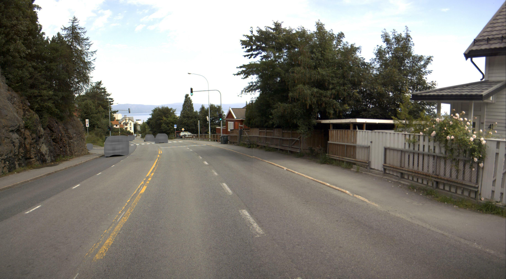
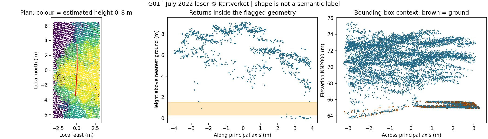

# Follow-up of the ten uncertain findings

**Six findings closed at screening level; four remain uncertain. No NVDB discrepancy is confirmed.**

Review date: 15 September 2026. Reviewer: Codex, using visual inspection and local laser diagnostics. These are evidence-based screening decisions, **not independent ground truth or field validation**. The original detections and thresholds are unchanged.

## What changed

| Finding | Decision | Evidence and limitation |
|---|---|---|
| G01 | Reject missing-barrier interpretation | A 20 July 2022 road photograph shows steel rail with mesh panels at the frontage under the canopy. The laser contains high canopy returns and little support in its height band. The exact failure mechanism remains unproven. |
| C02 | Reject: wooded slope | The 2022 cloud contains tree/undergrowth volumes. Spring imagery places the hull on the slope beyond the registered roadside rail, beside the track. |
| C04 | Reject: wooded slope | Broad vegetation volume in the 2022 cloud; spring imagery exposes the terrain between road and track. |
| C08 | Reject: track-side vegetation | Irregular shrub and low returns in 2022; spring imagery resolves the vegetated track margin separately from the registered rail. |
| C10 | Reject: track-side vegetation | Irregular undergrowth/tree returns below the road-level wall and rail; the candidate lies on the slope beside the track. |
| C16 | Reject: track-side vegetation | Low irregular returns at the track margin; spring imagery supports vegetation/terrain rather than an additional roadside barrier. |
| C03 | **Uncertain** | A persistent linear boundary separates parking/access from the track. Road-facing photos show the nearer registered rail, not this boundary. Its type is unresolved. |
| C05 | **Uncertain** | A boundary and vegetation coexist beside the track/access lane. The low laser feature cannot reliably be assigned a barrier type. |
| C07 | **Uncertain** | A hedge-like feature is visible in 2022. The forecourt changes in later imagery, so its cleared state cannot settle what stood there in 2022. |
| C11 | **Uncertain** | Low hedge/wall-like boundary beside the access lane. Available road cameras are over 40 m away and the road-level wall obscures the target. |

The six rejections have **medium confidence**. For the five vegetation cases, the spring images are corroboration from later dates. They do not categorically exclude a concealed or subsequently removed 2022 object. These labels should not be used as training ground truth without independent review.

Overall: **12 rejected candidates + 1 rejected gap + 4 uncertain candidates = 17 reviewed flags**. Seven candidate rejections were already present in the [first-pass review](review_first_pass.csv). Updated decisions are in [review.csv](review.csv); the four outstanding locations and coordinates are in [field_checks.csv](field_checks.csv).

## G01: barrier present despite low laser support

NVDB object **671258022**, FV6650 S2D1 m842–856, has its own line geometry and properties describing steel rail, steel posts, and mesh panels. The flagged section is the first seven metres of that geometry, beside the tree-covered frontage. The street photograph shows the steel rail/mesh arrangement in front of the wooden privacy fence on the right side of the north-facing view.



Source: Statens vegvesen, [Vegbilder dataset, NLOD](https://dataut.vegvesen.no/nb/dataset/vegbilder). This is the service's anonymized image, copied without altering image content. Timestamp, camera position, feature ID and SHA-256 are in [evidence_manifest.json](evidence_manifest.json). The frame precedes the laser flights by 9–10 days; presence on the exact flight date is inferred rather than directly observed.



The height profile is dominated by returns several metres above ground. This is consistent with canopy interception. It does not establish whether occlusion, line placement, ground estimation, or a combination caused the detector's low support. No threshold was changed to hide the flag.

## Evidence collected

- **Road photographs:** FV6650, 8 June and 20 July 2022, public [Vegbilder](https://vegbilder.atlas.vegvesen.no/) WFS catalog. Nearest forward-facing frames in available lanes were selected around each candidate's centre. These are location aids, not guaranteed full coverage of every polygon, particularly the 104 m C02 polygon. Same frames may support neighbouring cases; they are not independent observations.
- **Laser:** unchanged July 2022 cloud and cached height estimates. Each of the ten cases has a plan, an along-axis height profile, and an elevation cross-section in [evidence/](evidence/). Profiles contain all returns inside the polygon, not only the DBSCAN member points. G01 uses a 0.5 m buffer around the flagged line. Cross-sections use the local bounding box expanded by 3 m.
- **Aerial comparison:** Trondheim kommune 2022 (3999, 24 August 2022); Trondheim 2024 (4629, 5 May 2024); Trondheim MOF 2026 (5077, 17 April 2026). Dates are project metadata, not populated individual-raster timestamps. Owners and selected raster IDs are in the manifest. Imagery remains local under its source terms.
- **NVDB:** the existing September 2026 reference extract, including G01's object properties. It is not a historical 2022 snapshot.

Spring images exposed ground beneath deciduous trees. Initial exports were visibly blurry because overview rasters appeared among the source records. The downloader now specifies spatial intersection and selects rasters with `lowps <= 0.11` m. The final spring evidence uses the `_native` files; the coarse trial exports are not used for decisions.

## Remaining checks

- **C03 and C05:** inspect the boundary from the parking/access-lane side. Establish whether it is a vehicle barrier, pedestrian/track fence, or another structure, and whether it existed in July 2022.
- **C07:** obtain a close, dated 2022 photograph or property/maintenance record. A present-day visit cannot reconstruct the changed forecourt by itself.
- **C11:** inspect the access-lane boundary at close range and establish its type and history.

The available online road images, spring aerial images and point profiles do not support definitive labels for these four. They remain explicitly open rather than being counted as confirmed discrepancies or rejected detections.

## Reproduce this follow-up

After the real-data pipeline in [REPORT.md](REPORT.md), run from the project root:

```powershell
python scripts/followup_study.py
python scripts/followup_profiles.py
python scripts/review_study.py outputs/real --project 4629 --label 2024_native --date 2024-05-05 --cases G01 C02 C03 C04 C05 C07 C08 C10 C11 C16
python scripts/review_study.py outputs/real --project 5077 --label 2026_native --date 2026-04-17
python scripts/report_study.py
python scripts/package_followup.py
```

Downloads need network access. Road URLs expire; the downloader obtains fresh URLs and the published manifest omits their temporary query credentials. The report script reuses explicitly recorded decisions and checks detection geometry hashes; it does **not** perform automated visual adjudication. Reassess the labels if source evidence changes. Summary counts are computed from the decisions rather than hard-coded.
